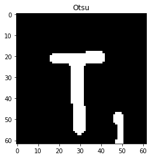

# Scrabble score calculator - description

For each game, I keep the state in a matrix of size 15x15 called `board`, where cells contains the letter tiles placed during the game or `None` if the cell is empty. Also, for each turn I keep track of the placed tiles in an array of coordinates `(i, j)`, called `tiles`.

For each turn, represented by a `test_img` in the `input_folder`, I read the image and match it to a template, which is an image of an empty Scrabble board. For matching I use a `SIFT` detector to find the keypoints and descriptors of the template and test image. I obtained the matches using a `FlannBasedMatcher` and filtered them using Lowe's distance ratio test. Then, with the good matches, I extracted the locations of matched keypoints in both imgs and found a perspective transformation between the two planes with `cv.findHomography`. Finally, using the obtained homography I was able to warp the test image to the template with `cv.warpPerspective`. After that, I cropped only the board from the transformed test image using corners' coordinates from the template, by applying a simple `cv.getPerspectiveTransform`. I obtained a 615x615 new image viewed from above as in the example:

  
  

  
  

After I obtained the preprocessed test image, the next step was to extract each cell from the board in an array called `patches`, in a similar way as we did in laboratory 2. Firstly, I got the 16 vertical and horizontal lines which form the cells and the I obtained all 225 (15x15) patches from the board.

Next step was to iterate through the patches and to identify the tiles placed in the current turn.

  

Empty cells are detected by computing the coefficient of variation (`stddev / mean`) of the patch image and comparing it with a threshold. To detect the blank tiles I computed and compared the mean ssd between the patch image and an extracted image of a blank tile. Then, in order to extract the letter from the tile I had to preprocess the patch image. I started by resizing the original patch image from 31x31 pixels to 62x62 pixels in order the character height to be around 30 pixels. I applied a light blur to straighten the lines and then Otsu's binarization. I got the contours with a certain size and pixel coordinates in order to get only the letter and not other noise. If I didn't find such contour it means that the tile is a special blue/red tile. Next, I applied a mask over the contour to extract the letter as in the example:

  
  
  
  

Next step was to extract the letter from the preprocessed patch image. For that, I used an OCR from `pytesseract` library. Finally, all I had to do was to write to the output file the coordinates of the predicted letter and the computed score at the end of the file, as in the requirements.
